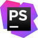

# Exploring component based webDevelopment with ReactJS
### group project started during our first week off from BeCode training (22/11/2021 - 26/11/2021)
## Challenge
Using ReactJS for the first time we are trying to build a website that scrolls infinitely by rendering new randomized landing pages.

## The objective of this exercise

* Get our first experience in ReactJS
* Learn to build functional and class based components
* Build templates based on those components
* Use an MVC model throughout the process
* Learn as much fun tricks as possible
* Have fun!

## Tools and languages used

|  | Description | Who? |
| ----------- | ----------- |----------|
|  | Ubuntu 20.04 | Sven|
|  | Windows 10 | Jörg, Daryl, Stefan |
|  | PHPStorm | Sven, Jörg |
| | VSCode | Daryl, Stefan |
|  | HTML5 | All |
|  | CSS3 | All |
|  | JS | All |
|  | ReactJs | All |
|  | Using git for version control | All |
|  | Hosting my files on github | All |

## Resources
- [Font API](https://developers.google.com/fonts/docs/developer_api)
- [Image API](https://unsplash.com/developers)
- [Color API](http://www.thecolorapi.com/)
- [Jeff Goldblum Quote API](https://jeffsum.com/)
- [Complementary Colors Package](https://www.npmjs.com/package/complementary-colors)

## Timeline

* Day 1 (:date:22/11/2021)
  * Daryl had the project ready to go by the time we got together for the first briefing
    * using create react app he built the basic app structure
    * all we had to do was git clone, open in our IDE and run the command yarn install to install all the packages he pre-installed
  * Sven found an infinite scroll function and managed to get it working with <divs> at 100VH in random colors
    * Daryl got it working in ReactJS
  * Since it was the first time most of us used React, or component based programming for that matter, we started by trying to split the project up into smaller parts (components)
  * There was some confusion about the use of functional versus class based components but Daryl once again explained as much as he could
  * By the end of day 1 we had a few reusable components that could be called on from the views
  * We also had found inspiration for our templates from the [Awwwards developer winners](https://www.awwwards.com/websites/developer/)
    * our landing page is a mash-up between [this](https://hugonicaise.fr/) and [this](https://konfiture.com/) built by Daryl (layout) nad Jörg (animations)
    * template 1 is inspired by [this](https://flayks.com/) and built mostly by Stefan 
    * template 2 is inspired by [this](https://hugonicaise.fr/) and built by Daryl(?)
    * template 3 is inspired by [this](https://danielebuffa.me/work) and built by Sven
* Day 2 (:date:23/11/2021)
  * We had a better understanding of what components were and what we wanted them to do, so we further refined our file structure
  * We knew we wanted to use random images and [Unsplash](https://unsplash.com/) and their API seemed like the best fit for this project
    * especially since their API also holds the color information of the image, which inspired us further into...
    * finding a function/package/api to create a color palette based on the image main color
      * Jörg found [this npm package](https://www.npmjs.com/package/color-scheme) which we ended up using
    * We ran into a problem with the unsplash API due to the call limits, so we had to find a fix
      * in the end Sven wrote a PHP script to create a json file with about 140 images (excluding the ones with a grey tone as the main color because of an issue with the color-scheme package)
    * We continued building the lowest level components, getting those to work as we wanted
* Day 3 (:date:24/11/2021)
  * Once we got to a point where the basic blocks were done, we could start looking at migrating the logic to higher levels, or even outside the components
  * We started work on the templates
    * calling blocks up from the lowest levels and giving them some basic styling(static)
    * working with the color-scheme package
* Day 4 (:date:25/11/2021)
  * Most of the components were there now, the functionality was still missing though
  * Daryl created the base for the header(our landing page) and fixed all the merge conflicts the rest of us created (thank you!)
  * he also split the logic into their respective places (store, utils,...)
  * Sven decided he wanted to try working with `<svg>` (why?) because it looked like fun! So he created a new functional component called `Svg`
  * Stefan built template 1 with the animated gradient background (so cool!)
  * At the end of day 4 we had something that resembled a webpage!
* Day 5 (:date:26/11/2021)
  * Day 5 started with a new pull request to update our local branches
  * The development branch was now as up to date as it could be at this point
  * Sven continued on with template 3 (adding in the movement)
    * He had some trouble using vanilla JS concepts, but managed to implement ReactJS useRef to get the dynamics working
  * Jörg decided to play around with the Svg component in the header and added some `GSap` pizaz to it!
  * Daryl fixed the navigation overlay to be visible on all pages and still keep the functionality of the template below (`position: absolute vs fixed`)
    * He also once again kept the development branch up to date
  * Sven ended the day by writing this Readme!

# Must Haves

## Structure
- Get everyones configurations working
- Configure sth to format code
- Follow import protocol in index files
- 
## Landing page
    - Explain concept
    - NavBar to github profiles and project repo
    - Instructions
    - Scrolls to project
## Random pages
    - Nav to github profiles and project repo
    - Header ->
        - Title
    - Section ->
        - Background
        - Text
        - Image(s)

# Nice to Haves
- Component animation(s)

# Components So Far
- Text
- Image
- Title
- Link
- Button

# Getting Started with Create React App

This project was bootstrapped with [Create React App](https://github.com/facebook/create-react-app).

## Available Scripts

In the project directory, you can run:

### `yarn start`

Runs the app in the development mode.\
Open [http://localhost:3000](http://localhost:3000) to view it in the browser.

The page will reload if you make edits.\
You will also see any lint errors in the console.

## Learn More

You can learn more in the [Create React App documentation](https://facebook.github.io/create-react-app/docs/getting-started).

To learn React, check out the [React documentation](https://reactjs.org/).